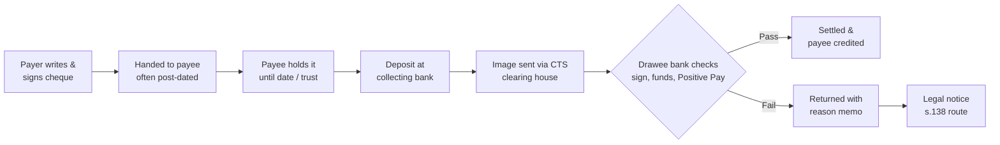
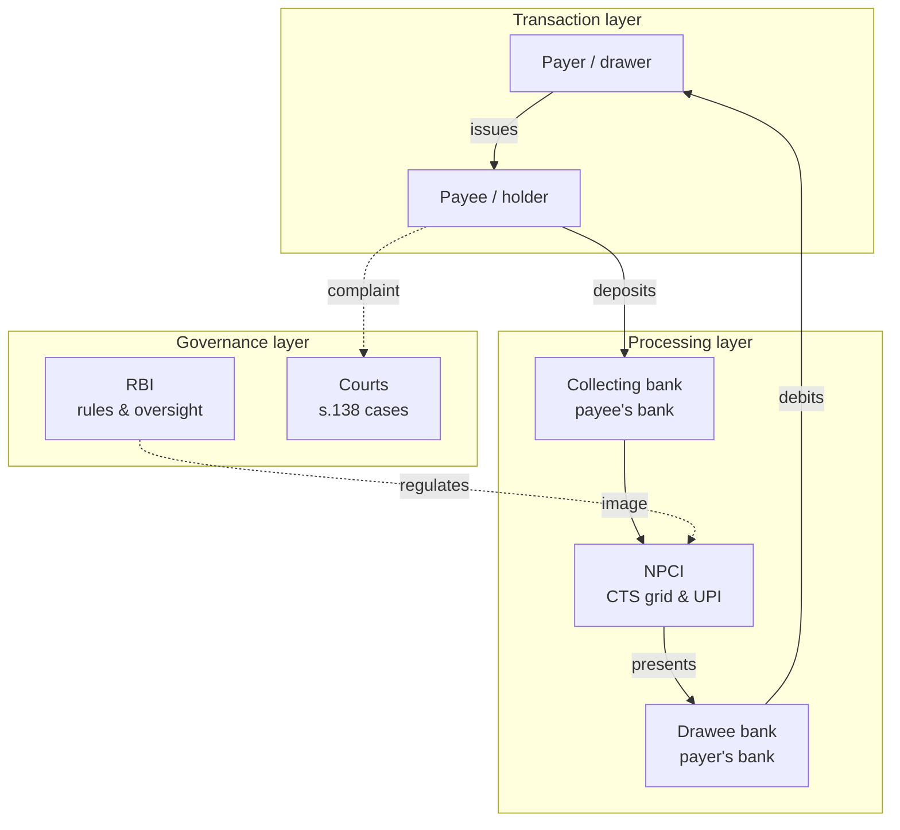

# Digital Cheque — Foundation Analysis

Sep 23, 2026 · @sukhman

## How to read this doc

Cheques survive mainly because they are a **legally backed promise to pay later**, not just a way of moving money. Every claim below carries one evidence label so assumptions never pass as findings.

| Label | Meaning | Example |
| --- | --- | --- |
| **Statutory** | Written in an Act (mainly the Negotiable Instruments Act, 1881) | s.138 makes dishonour for insufficient funds an offence |
| **Regulatory** | RBI / NPCI rule or circular | Positive Pay for cheques of ₹50,000 and above |
| **Industry practice** | What banks, landlords or lenders commonly do, not required by law | Lenders collecting undated security cheques |
| **Secondary finding** | Reported by a published source (court data, reports, articles) | Share of pending cases that are cheque-bounce cases |
| **Hypothesis** | Our assumption, to be tested in primary research | "Payees value the criminal threat more than the payer's trust" |

No primary research has been done yet. Nothing in this doc is a **validated finding**.

This is a research aid, not legal advice. Legal points should be checked against the bare Act and a legal expert before being used in the final design.

## Problem framing

**Reframed problem:** People in India still reach for a cheque when they need a payment that is *promised now, paid later, provable, and enforceable*. Instant rails (UPI, IMPS, NEFT) move money well but do not express that promise.

**Working problem statement (Hypothesis):** How might we give payers and payees a digital way to commit to, authorise, track and enforce future payments — with the trust and legal weight of a cheque, but without its delays, fraud surface and litigation burden?

**In scope**

- Cheque use by individuals, landlords/tenants, MSMEs/vendors, lenders and institutions
- The full lifecycle: writing, handing over, holding, presenting, clearing, dishonour, legal follow-up
- NI Act 1881, RBI clearing rules, and the digital rails that overlap with cheque functions

**Out of scope (for now)**

- Visual/UI design (per the project process, this comes after opportunity areas)
- Demand drafts and pay orders, except as comparison points
- Building a payment rail — the concept should sit on existing bank/NPCI infrastructure

**The core tension to design around:** the features that make cheques *trusted* (formality, delay, legal threat) are the same ones that make them *painful*. The design task is to keep the first and remove the second.

## Current cheque lifecycle

A cheque's life has two very different halves: a **slow, informal "promise" phase** held by people, and a **fast, digital "clearing" phase** run by banks. Most friction and risk sits in the first half and at dishonour — not in clearing, which is already image-based.

Left half (A–C) is paper and people; middle (D–G) is already digital; right branch (H–I) moves into courts.

| Stage | What happens | Evidence type | Friction / risk |
| --- | --- | --- | --- |
| 1. Drawing | Payer fills date, payee, amount in words/figures, signs | Statutory (NI Act s.6, s.7) | Errors, overwriting, mismatched amounts; signature is the only authentication |
| 2. Delivery | Handed over in person, by courier, or left with landlord/lender | Industry practice | Theft, loss, no receipt of handover; payee often holds several PDCs at once |
| 3. Holding | Payee waits for the cheque date or for a condition to be met | Industry practice | Payer cannot see or easily stop a pending cheque; payee has no guarantee funds will exist |
| 4. Presentation | Must be presented within 3 months of the cheque date | Regulatory (RBI validity rule) + Statutory (s.138 proviso a) | Missed windows; branch/ATM drop-box trips |
| 5. Clearing | Collecting bank scans; image cleared through CTS. Continuous clearing Phase 1 from 4 Oct 2025: presentation 10 am to 4 pm, confirmation till 7 pm, unconfirmed items deemed approved; revised on 24 Dec 2025 to presentation 9 am to 3 pm, confirmation 9 am to 7 pm | Regulatory (RBI CTS) | Phase 2 (settlement within \~3 hours) deferred "until further notice" in Dec 2025 |
| 6. Verification | Drawee bank checks signature, funds, and Positive Pay details if submitted | Regulatory (Positive Pay, 2020 circular) | Payer must remember to submit PPS details separately — a second, disconnected act |
| 7. Settlement | Payee's account credited | Regulatory | Payee often learns via SMS only; no link back to the original agreement |
| 8. Dishonour | Returned with a reason memo (e.g. funds insufficient, signature mismatch) | Regulatory / bank practice | Payee must now start a legal clock (see Legal section) |

**Key observation (Secondary finding):** India already moves the *cheque image*, not the paper, between banks. So "digitising the cheque" is partly solved at the back end. The unsolved parts are the **front end** (creating, delivering, holding, tracking) and the **dishonour end** (proof, notice, enforcement).

## Stakeholder map

The payer and payee carry the risk; banks and NPCI carry the process; courts carry the enforcement. A digital cheque has to earn trust from all three layers, not just the two app users.

Solid lines are money/instrument flow; dotted lines are oversight and enforcement.

| Stakeholder | Role | What they need from a cheque | Hypothesised pain |
| --- | --- | --- | --- |
| Payer (drawer) | Writes and signs; owns the account | Control over *when* money leaves; a formal record | Can't track pending cheques; criminal liability if funds fall short |
| Payee (holder) | Receives and presents | Assurance of future payment; legal leverage | Waiting, bank trips, bounce risk, slow litigation |
| Drawee bank | Pays or returns the cheque | Fraud prevention, clear mandate | Signature disputes, altered cheques, PPS gaps |
| Collecting bank | Collects for payee | Protection when collecting in good faith (s.131) | Handling physical instruments and returns |
| NPCI | Runs CTS grids and UPI | Standardised, secure image and data | Two parallel worlds (CTS and UPI) with little overlap |
| RBI | Sets clearing, PPS, validity rules | Safety and efficiency of payments | Still-large residual paper instrument usage by value |
| Courts | Hear s.138 complaints | Clear evidence of debt, dishonour, notice | Heavy backlog of cheque cases (see Legal section) |
| Landlords, lenders, vendors, institutions | Demand cheques as security or payment | Enforceable commitment from the other party | Chasing payers, storing PDC bundles |
| Lawyers / notaries | Draft notices, file complaints | Proof of dates and delivery | Manual reconstruction of timelines |

**Design implication:** courts and banks are *invisible users*. Any digital cheque record should be designed to be read by a judge or a bank officer, not only by the payer and payee.

## Why cheques persist

Cheques are small in count but not in weight: digital modes were 99.7% of payment *volume* in 2024, yet paper instruments still held about 2.3% of *value* in RBI's June 2025 Payment Systems Report (Secondary finding). That pattern points to **high-value, high-stakes, relationship-bound payments** — not to people who can't use UPI.

The table separates what a cheque *actually does* (a function) from why people *say* they use it (often assumed).

| Underlying need | How the cheque meets it | Evidence type | Do digital rails meet it today? | Confidence |
| --- | --- | --- | --- | --- |
| **Enforceable promise** | Dishonour for lack of funds is a criminal offence (s.138) with a presumption of debt in the payee's favour (s.139) | Statutory | Partly — s.25 of the Payment and Settlement Systems Act, 2007 mirrors s.138 for failed electronic funds transfers (e.g. NACH mandates), but it is little known and only covers payer-initiated debits under a system's rules | High |
| **Future-dated payment** | Post-dated cheque locks in amount and date today | Industry practice | Partly — NACH / UPI AutoPay cover recurring merchant debits; no simple P2P "pay on date X" | High |
| **Payer control of debit timing** | Money leaves only when the payee presents | Industry practice | Partly — scheduled NEFT is payer-controlled but gives the payee no commitment | Medium |
| **Security / collateral** | Lenders and landlords hold undated or post-dated cheques as a threat of s.138 | Industry practice; SC has held PDCs for existing debt attract s.138 | Weak — e-mandates exist but carry less perceived legal "bite" | Medium |
| **Formal documentation** | Physical artefact with payee name, amount, signature, cheque number | Industry practice | Partly — UTR numbers prove transfer, but carry no purpose, agreement or signature | Medium |
| **Large-value P2P** | No per-instrument cap | Regulatory | Partly — UPI P2P stays at ₹1 lakh/day; NEFT/RTGS have no such cap but no future-dating | High |
| **Institutional habit / compliance** | Some institutions, courts, government bodies and societies specify cheque or DD | Industry practice | Varies by institution | Low — needs field check |
| **Ritual and formality** | Signing feels deliberate and binding | Hypothesis | Unknown — UPI feels casual by design | Low |
| **Unfamiliarity with digital** | Older or rural users trust paper | Hypothesis (commonly assumed) | Probably overstated for business users | Low — treat with caution |

**Most important insight (Hypothesis, strongly supported by secondary evidence):** the cheque's real product is **legal leverage for the payee**. The payer mostly *tolerates* the cheque; the payee *demands* it. So a digital cheque that only pleases payers will fail. It must give payees at least equal assurance.

**Genuine needs vs assumptions**

- Likely genuine: enforceability, future-dating, security for credit, documentation, high-value P2P.
- Likely assumption to test: "people use cheques because they don't trust or understand UPI."
- Unknown: how much the *physical* act of signing matters versus the *legal* consequence it creates.

## Legal and regulatory context

The law already allows a digital cheque: s.6 of the NI Act has included "a cheque in the electronic form" since the 2002 amendment. What India lacks is a live *system* that issues one — so the design gap is infrastructure and experience, not legal permission. Since March 2026, the RBI has formally committed to explore introducing e-cheques (see RBI Payments Vision 2028 below).

**The s.6 definition (Statutory):** a cheque is "a bill of exchange drawn on a specified banker and not expressed to be payable otherwise than on demand and it includes the electronic image of a truncated cheque and a cheque in the electronic form." An electronic cheque is one "drawn in electronic form by using any computer resource and signed in a secure system with digital signature (with or without biometrics signature) and asymmetric crypto system or with electronic signature" (Explanation I). Terms like "digital signature" take their meaning from the IT Act, 2000 (Explanation III).

### Key NI Act provisions for the project

| Provision | What it says (summary) | Why it matters for design |
| --- | --- | --- |
| s.6 | Defines cheque; includes truncated image and electronic cheque | Legal hook for a digital cheque; signing must meet IT Act standards |
| s.7 | Drawer, drawee, payee defined | Roles map directly to app actors |
| s.123–131 | Crossing ("A/c payee" etc.) and collecting banker protection | Digital equivalent = pay only to a verified account of the named payee |
| s.138 | Dishonour for insufficient funds is an offence: up to 2 years' jail, fine up to twice the amount, or both | The "bite" users value; must be preserved, not bypassed |
| s.138 provisos | (a) presented within 6 months or validity, whichever is earlier; (b) written demand within 30 days of learning of dishonour; (c) drawer fails to pay within 15 days of notice | These are timers a system can track and prompt automatically |
| s.139 | Presumes the cheque was for a debt, unless the drawer proves otherwise | Shapes the evidence a record must preserve |
| s.142 | Court cognisance; jurisdiction where the payee's bank branch is (2015 amendment) | Where the payee's account sits affects legal venue |
| s.143A, s.148 | Interim compensation up to 20% during trial; appellate court may order a deposit of at least 20% of the fine or compensation (2018 amendment) | Raises stakes on dishonour for payers |
| s.147 | Offences are compoundable (settleable) | Opportunity for early, digital settlement |

Section summaries are paraphrased for design research; check the bare Act before citing in the final report.

### Regulatory and banking practice

| Rule | Source and date | Type |
| --- | --- | --- |
| Cheque validity is 3 months from its date | RBI, effective 1 Apr 2012 | Regulatory |
| Positive Pay: banks must enable it for cheques of ₹50,000+; may make it mandatory at ₹5 lakh+; only compliant cheques get CTS dispute resolution | RBI circular, 25 Sep 2020, live 1 Jan 2021 | Regulatory |
| Many banks made PPS mandatory for ₹5 lakh+ | e.g. from 1 Aug 2022 | Industry practice |
| Continuous clearing, Phase 1 (same-day, confirmation by 7 pm) | Live from 4 Oct 2025 | Regulatory |
| Phase 2 (settlement within \~3 hours) | Deferred until further notice, Dec 2025 | Regulatory |
| NBFCs told to stop relying on old post-dated cheques and move to CTS-2010 standard cheques | RBI, by 31 Dec 2012 | Regulatory |
| s.25, Payment and Settlement Systems Act, 2007: failed electronic funds transfer for lack of funds is an offence with the same penalty as s.138; NI Act Chapter XVII applies as far as possible | Statutory | Statutory |

### Courts and the dishonour burden

- The Supreme Court noted in Sept 2025 that s.138 cases were about 49% of trial-court pendency in Delhi; pending cheque cases stood at about 6.5 lakh in Delhi and 2.66 lakh in Kolkata district courts (Secondary finding).
- *Sanjabij Tari v. Kishore S. Borcar* (25 Sep 2025) directed: summons by email/WhatsApp, **QR/UPI links in district courts to pay cheque amounts online**, a standard complaint synopsis, and graded costs for late settlement (0% before defence evidence, 5% before judgment, 7.5% at sessions/High Court, 10% at Supreme Court).
- *Sampelly Satyanarayana Rao v. IREDA* (SC): a post-dated cheque for a loan whose debt exists on the cheque date attracts s.138.

**Design takeaway:** the legal system is itself moving toward digital notice and digital settlement. A digital cheque that produces court-ready records (dates, notice delivery, payment attempts) aligns with where the courts are heading.

### RBI Payments Vision 2028 (27 Mar 2026)

The RBI's official roadmap to Dec 2028 commits only to **explore** e-cheques — in two sentences, with no design, timeline, legal route or definition. The shape of a digital cheque is still undefined (Regulatory; read from the [official PDF](https://rbidocs.rbi.org.in/rdocs//PublicationReport/Pdfs/PAYMENTSVISION2028270326500316AFADEB47259CB970132BA01304.PDF)).

- **Theme:** "Shaping India's Payment Frontier"; stated challenge is "deepening trust", not just extending reach.
- **Section 3.10, cheque review:** banks have added their own security features on top of CTS-2010, causing variation; a full review will standardise design and strengthen fraud prevention.
- **Section 3.10, e-cheques (verbatim):** "To leverage the unique benefits of paper-based instruments and the speed and reliability of electronic payments, and cater to new business use cases, introduction of electronic cheques in India shall be explored."
- **Not addressed:** NI Act, s.138, dishonour, clearing, signatures, or which "unique benefits" are meant.

| Related initiative | What it proposes | Link to this project (our reading) |
| --- | --- | --- |
| 3.1 Enable/disable switch | Turn transactions on/off for every digital payment mode, as with cards today | Precedent for payer control |
| 3.5 Shared responsibility | Payer's bank and payee's bank jointly liable for unauthorised transactions | Two-sided accountability |
| 3.8 TReDS upgrades | Interoperability, factoring with recourse, export MSMEs | Parallel RBI tool for MSME credit, our primary segment |
| 3.13 Payments Switching Service | See all payment flows linked to an account and move them | Precedent for one pending-payments view |
| 3.15 Domestic LEI | One identifier for non-individual entities | Could verify business payees |

**Design takeaway:** we are working ahead of the regulator. The research can define what 3.10 leaves blank — which cheque benefits matter, and to whom.

**Open legal questions (for an expert):**

- [ ] Can a future-dated digital instrument be a "cheque", given s.6 says "payable on demand"? (A post-dated paper cheque becomes one on its date — does the same logic hold digitally?)
- [ ] Which signature standard (Aadhaar e-sign, DSC, bank PIN) meets s.6 Explanation I?
- [ ] Would a digital cheque be better built under the NI Act (s.138) or the PSS Act (s.25)?

## Digital alternatives: gap analysis

Every cheque function already exists *somewhere* in India's digital stack — but scattered across different rails, mostly merchant-only, and never bundled into one person-to-person "promise to pay". The gap is **composition**, not technology.

| Cheque function | Paper cheque | UPI (P2P) | NEFT / RTGS | NACH e-mandate / UPI AutoPay | UPI Reserve Pay (block & debit) |
| --- | --- | --- | --- | --- | --- |
| Instant transfer | No | Yes | Near-instant | No | No |
| Future-dated, fixed amount | Yes (PDC) | No | Scheduling in some bank apps (payer-controlled) | Yes, recurring | Time-bound block |
| Payee holds a commitment | Yes | No | No | Yes | Yes |
| Works person-to-person | Yes | Yes | Yes | Mostly merchant/lender | Merchant only |
| High value | No cap | ₹1 lakh/day P2P; up to ₹5 lakh/txn for select P2M categories (Sep 2025) | High / no cap | Varies by mandate | Low, merchant use cases |
| Legal remedy on failure | s.138 NI Act | Weak / unclear | Not applicable (payer never sent) | s.25 PSS Act | Funds pre-blocked |
| Payer sees & can cancel pending item | Only by stop-payment request | n/a | Yes | Yes (revoke mandate) | Yes (revoke) |
| Formal record with purpose & signature | Physical instrument | UTR + note | UTR | Mandate record | Mandate record |

Table reflects Sept 2025 NPCI limits and published product descriptions; bank-level limits may be lower.

**What digital already solves:** speed, clearing, remote delivery, low fraud from forged paper.

**What it does not solve:**

- A **P2P, single, future-dated, high-value commitment** that the payee can hold.
- A **legally recognisable artefact** that a landlord, supplier or court treats as equal to a cheque.
- A shared **status view** for both sides of a pending payment.

**Cheque traits to translate:** payee-held commitment, future date, named payee (crossing), signature-as-intent, legal consequence.

**Cheque traits NOT to copy:** paper handling, 3-month dead windows, blind waiting, manual notices, signature-matching by eye, undated "blank" security cheques (a coercive practice).

## User segments and prioritisation

**Recommended primary focus: MSME supplier–buyer payments, with rent/deposits as the secondary segment.** Both rely on post-dated promises between two private parties, where digital rails have the biggest P2P gap and the payee's need for leverage is strongest.

| Segment | Typical cheque use | Core need | Gap vs digital | Access for research | Priority |
| --- | --- | --- | --- | --- | --- |
| MSMEs & vendors | PDCs for credit terms (30/60/90 days), advance and security cheques | Enforceable future payment; cash-flow control | High — no P2P future-dated commitment | Good (local traders, Gandhinagar/Ahmedabad markets) | **1** |
| Tenants & landlords | Rent PDC bundles, security deposit cheques | Assurance of rent; tenant control | High | Good (students, local owners, brokers) | **2** |
| Borrowers & lenders (NBFCs, informal lenders) | Security / undated cheques alongside NACH | Collateral and legal leverage | Medium — NACH exists; cheque kept as extra "bite" | Medium (lenders may be guarded) | 3 |
| Individuals (large P2P) | Family transfers, property token money, car sales | High value, formal proof | Medium — NEFT/RTGS works but feels informal | Good | 4 |
| Institutions (schools, societies, government) | Fees, deposits, refunds, grants | Compliance, reconciliation | Low–medium — mostly policy/habit | Medium | 5 |

Priority is a **Hypothesis** based on gap size, stakes, and research access; revisit after the first 8–10 interviews.

**Why not start with institutions?** Their cheque use is driven by internal policy, so the fix is often procedural, not experiential. Less design leverage for an M.Des project.

## Hypotheses and jobs-to-be-done

Ten testable hypotheses, each with the signal that would disprove it. None is validated yet.

| # | Hypothesis | Disproved if… |
| --- | --- | --- |
| H1 | Payees, not payers, drive cheque demand | Most payers say *they* choose cheques unprompted |
| H2 | The s.138 threat matters more to payees than the paper itself | Payees would accept a digital instrument without clear legal backing |
| H3 | MSMEs use PDCs mainly to formalise credit terms | Cheques are mostly used for immediate payment |
| H4 | Payers lose track of issued, not-yet-presented cheques | Payers keep reliable records (registers, apps) |
| H5 | Bounce is often a timing mismatch, not bad intent | Most dishonours involve refusal to pay after notice |
| H6 | Payees avoid legal action because it is slow and costly, and settle informally | Most payees file complaints after bounce |
| H7 | Few payers know about or use Positive Pay | Most high-value payers submit PPS details routinely |
| H8 | A shared status view would reduce disputes | Disputes are about the underlying deal, not payment status |
| H9 | Signing a cheque feels more binding than a UPI PIN | Users rate both as equally serious |
| H10 | Nobody knows s.25 PSS Act gives e-mandates similar legal teeth | Payees already treat NACH as equal to a cheque |

### Jobs-to-be-done (draft)

- **Payer (MSME buyer):** When I buy on credit, I want to commit to paying on a future date without the money leaving now, so I keep my working capital and my supplier's trust.
- **Payee (MSME supplier):** When I give goods on credit, I want a commitment I can enforce if the buyer doesn't pay, so I'm not chasing money for months.
- **Tenant:** When I rent a home, I want to show I'm reliable for 11 months without handing over a stack of signed paper I can't track.
- **Landlord:** When I let a flat, I want assurance of rent and deposit, with proof if something goes wrong.
- **Both sides:** When a payment is pending, I want to see its status and what happens next, so neither of us is surprised.

## Opportunity areas and design principles

The strongest opportunity is a **payee-holdable, future-dated digital commitment with a built-in legal trail** — a "promise object" rather than a scanned cheque. These are exploration areas, not features.

| # | Opportunity area | "How might we…" | Grounded in |
| --- | --- | --- | --- |
| O1 | Digital promise to pay | …let a payer commit a future-dated amount that the payee can see and hold? | Gap analysis; H1, H3 |
| O2 | Shared lifecycle status | …give both parties one live view of issued, due, presented, paid or failed? | H4, H8 |
| O3 | Pre-due nudges | …warn payers before a due date if funds may fall short, to prevent bounce? | H5 |
| O4 | Court-ready records | …auto-create a timeline (issue, due, failure, notice, deadlines) usable as evidence? | s.138 provisos; SC 2025 guidelines |
| O5 | Guided dishonour path | …walk a payee through notice and settlement (s.147, SC's online-payment push) before court? | H6; Sanjabij Tari |
| O6 | Built-in Positive Pay | …make payee/amount confirmation part of issuing, not a separate chore? | H7; RBI 2020 circular |
| O7 | Fair security arrangements | …replace blank "security cheques" with bounded, transparent conditions? | Industry practice |
| O8 | Meaningful authorisation | …make approving a large future payment feel deliberate without paper? | H9 |

### Draft design principles

1. **Symmetric trust** — the payee's assurance must equal the payer's control.
2. **Legible to third parties** — any record should make sense to a bank officer or a judge.
3. **Formal, not frictional** — add weight at the moment of commitment, remove it everywhere else.
4. **No silent states** — both sides always know status and next step.
5. **Prevent before punish** — design to avoid dishonour first; enforcement is the fallback.
6. **Ride existing rails** — build on CTS, UPI, NACH and bank authentication, not a new network.
7. **Clear about the law** — show what is legally binding and what is not; never overstate protection.

**Early concept directions (for later exploration, not selection):** (A) bank-issued e-cheque under NI Act s.6; (B) a P2P future-dated mandate on UPI/NACH, relying on PSS Act s.25; (C) a "commitment layer" app that wraps existing rails with status, records and nudges.

## Research plan

Start with 12–16 semi-structured interviews across both sides of a cheque, plus 2–3 expert interviews, before any survey. Interviewing payer *and* payee in the same relationship tests H1 directly.

### Research questions

1. Who decides a cheque is used in a transaction, and why?
2. What does a cheque give a payee that UPI/NEFT does not?
3. How do payers track issued cheques and manage the balance for them?
4. What happens, step by step, after a cheque bounces?
5. What would make a digital commitment feel as binding as a signed cheque?

### Methods

| Method | Participants | Tests | Output |
| --- | --- | --- | --- |
| Semi-structured interviews | 6 MSME payers/payees, 4 tenants/landlords, 2 individual large-P2P users | H1–H6, H9 | Affinity map, JTBD |
| Expert interviews | 1 advocate handling s.138 cases, 1 bank branch/ops officer, 1 CA | H6, H7, H10; legal open questions | Constraint list |
| Artefact study | Cheque registers, PDC bundles, return memos, legal notices (anonymised) | H4, H5 | Current-state journey |
| Contextual observation | Bank branch drop-box and clearing counter | Stage 4–8 friction | Service blueprint |
| Card sort / trust ranking | Same interviewees | H9, principle 3 | Trust signal ranking |

### Interview guide starters

- "Tell me about the last cheque you gave or received. Walk me through it from the moment it came up."
- "Who suggested a cheque? What would have happened if you'd offered UPI instead?"
- "Where are the cheques you've issued but haven't been cashed yet? How do you know?"
- "Has a cheque ever bounced on you, or from you? What happened next?"
- "If a bank app let you promise a payment for a future date, what would you need to trust it?"

Ethics: never ask for account numbers or photographs of unredacted cheques; anonymise names in all notes.

## Sources

- [NI Act s.6 — definition of cheque (Indian Kanoon)](https://indiankanoon.org/doc/1012630/)
- [NI Act s.138 (Indian Kanoon)](https://indiankanoon.org/doc/1823824/)
- [PSS Act 2007 s.25 (Indian Kanoon)](https://indiankanoon.org/doc/158914850/)
- [RBI Positive Pay circular, 25 Sep 2020 (TaxGuru reproduction)](https://taxguru.in/rbi/positive-pay-system-cheque-truncation-system.html)
- [Positive Pay mandatory at ₹5 lakh+ by banks, Aug 2022 (Business Standard)](https://www.business-standard.com/article/finance/understanding-positive-pay-system-necessary-to-encash-cheques-from-august-1-122072600446_1.html)
- [CTS continuous clearing Phase 2 postponed (Business Standard, Dec 2025)](https://www.business-standard.com/finance/news/implementation-of-cheque-clearing-phase-2-postponed-until-further-notice-rbi-125122401018_1.html)
- [RBI Payment Systems Report, June 2025 coverage (Business Standard)](https://www.business-standard.com/industry/news/digital-payments-make-up-99-7-of-transaction-volume-in-2024-rbi-report-125102301064_1.html)
- [Sanjabij Tari v. Kishore S. Borcar guidelines (IndiaLaw)](https://www.indialaw.in/blog/criminal/sc-issues-guidelines-on-cheque-bounce-cash-loan-cases/)
- [SC on cheque-case backlog, Sept 2025 (Kashmir Observer)](https://kashmirobserver.net/2025/09/26/staggeringly-high-sc-tweaks-guidelines-to-reduce-backlog-of-cheque-bounce-cases/)
- [Post-dated security cheques and s.138 (law.asia)](https://law.asia/dishonour-of-post-dated-cheques-taken-as-security/)
- [RBI to NBFCs on post-dated cheques (Moneylife)](https://www.moneylife.in/article/rbi-to-nbfcs-replace-postdated-cheques-with-standardised-norm/29532.html)
- [NPCI UPI limits from 15 Sep 2025 (Paytm blog)](https://paytm.com/blog/news/upi-higher-transaction-limits-sep-2025/)
- [UPI Reserve Pay explainer (Pine Labs)](https://www.pinelabs.com/docs/online-payments/upi-reserve-pay)
- [RBI Payments Vision 2028, official PDF (27 Mar 2026)](https://rbidocs.rbi.org.in/rdocs//PublicationReport/Pdfs/PAYMENTSVISION2028270326500316AFADEB47259CB970132BA01304.PDF)

Secondary sources were used where primary RBI/NPCI pages could not be opened; confirm against rbi.org.in and npci.org.in before final submission.
